# Hiresemble

**흩어진 취업 준비를, 하나의 흐름으로.**

이력서와 포트폴리오에서 내 경험을 정리하고, 관심 공고를 등록하면 자동으로 분석하고, 그 결과를 자기소개서와 면접 준비까지 이어서 쓸 수 있는 개인 맞춤형 AI 취업 준비 서비스입니다.

취업 준비를 하다 보면 이력서는 이력서대로, 공고는 북마크대로, 자소서는 문서 파일대로 흩어집니다. Hiresemble은 이 과정을 하나로 묶되, **AI가 대신 지원해 주는 도구가 아니라 내가 확인한 경험을 근거로 다음 단계를 준비하게 돕는 도구**를 목표로 합니다. 그래서 분석 점수에는 항상 어떤 경험이 근거였는지가 함께 붙고, 자기소개서 초안도 확인되지 않은 사실을 만들어 내지 않도록 설계했습니다.


> 아래 화면은 모두 실제 서비스 화면을 캡처한 것이며, 개인정보 보호를 위해 데모용 예시 데이터를 사용했습니다.

---

## 어떤 흐름으로 쓰나요

```text
내 정보 정리 → 이력서·자료 등록 → 관심 공고 등록 → 자동 공고 분석 → 자기소개서 → 면접 준비
```

한 번에 다 채울 필요는 없습니다. 공고 하나만 등록해도 분석까지는 바로 이어지고, 내 정보와 자료가 쌓일수록 분석 커버리지와 근거가 함께 올라갑니다.

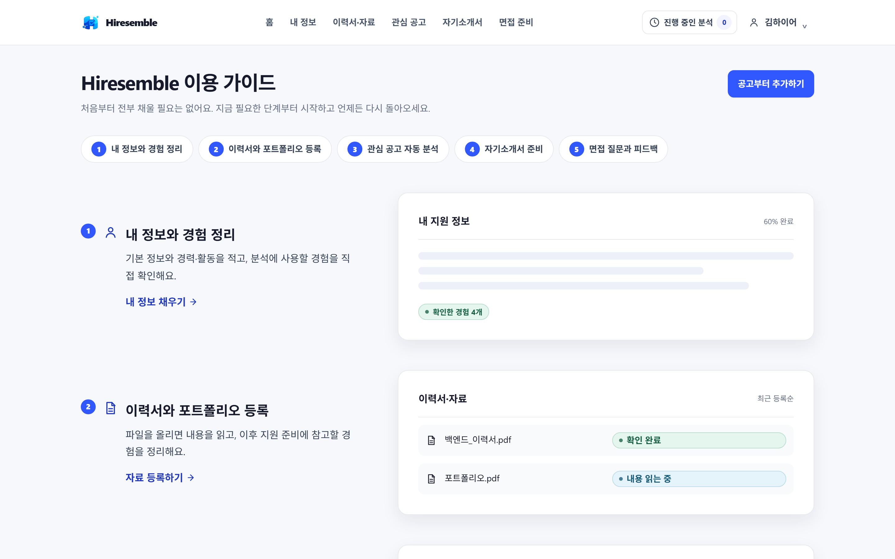

---

## 주요 기능

### 지원 준비 현황 대시보드

지금 무엇을 해야 하는지부터 보여 줍니다. 다가오는 마감, 준비 중인 공고와 지원 완료 수, 등록한 자료, 실행 중인 AI 작업을 한 화면에서 확인하고 바로 다음 행동으로 넘어갈 수 있습니다. 마감은 서울 기준 월별 캘린더와 D-day로 표시합니다.

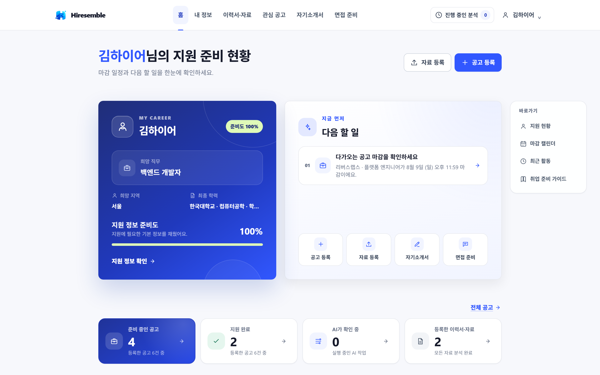

### 내 지원 정보

이름과 희망 조건 같은 기본 정보부터 학력·경력·자격증·어학·수상·대외활동까지 지원서에 공통으로 쓰이는 정보를 한곳에서 관리합니다. 여기에 입력한 내용은 그대로 공고 분석과 자기소개서의 근거가 됩니다.

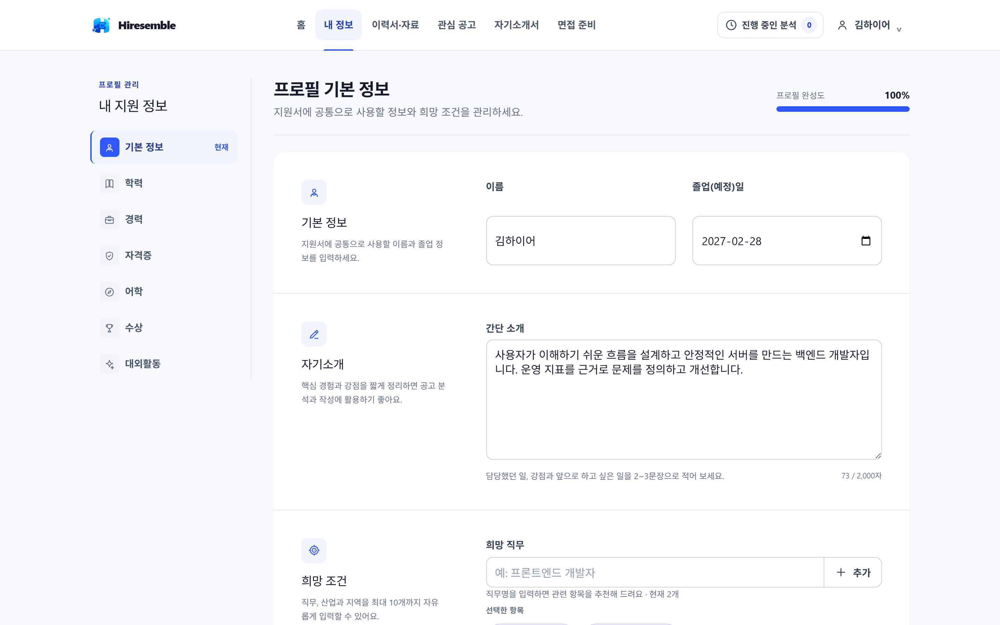

### 이력서·자료 등록과 경험 정리

PDF, DOCX, TXT 파일을 올리면 원본은 그대로 보관한 채 텍스트를 읽어 내고, 자기소개서와 면접에 쓸 만한 경험 후보를 정리합니다. 정리된 경험은 사용자가 직접 확인·선택하며, 확인한 항목만 이후 단계에서 근거로 쓰입니다.

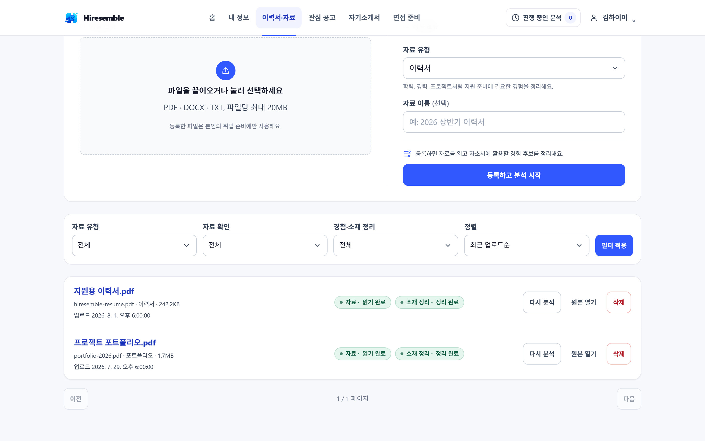

파일별로 읽기와 정리 상태를 따로 볼 수 있고, 자동으로 읽지 못한 파일은 텍스트를 직접 붙여 넣어 이어서 진행할 수 있습니다.

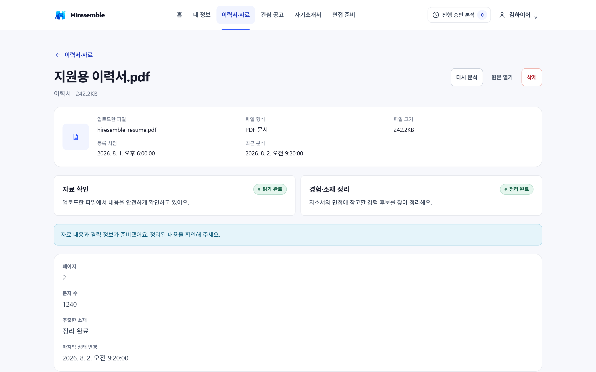

### 관심 공고 등록

채용 사이트의 공고 링크를 붙여 넣기만 하면 본문을 읽어 오고, 저장 직후 기본 분석까지 자동으로 이어집니다. 회사명·직무·마감 일시를 알고 있다면 함께 적어 둘 수 있고, 링크를 읽지 못하는 공고는 본문을 직접 입력할 수 있습니다.

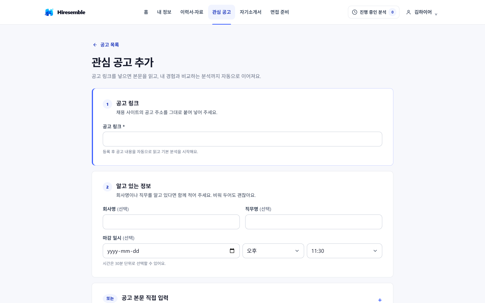

등록한 공고는 지원 중 / 서류 제출 / 마감 탭으로 나눠 보고, 등록 기간과 검색으로 좁힐 수 있습니다. 마감이 지난 공고는 서울 기준으로 자동 마감 처리됩니다.

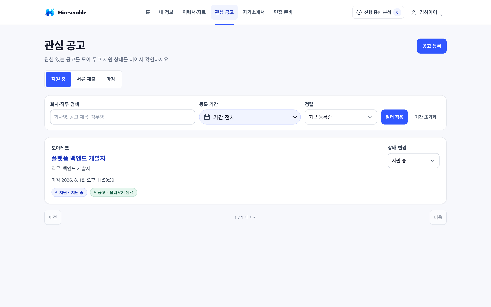

읽어 온 공고 본문은 원문 링크와 함께 읽기 좋은 형태로 정리해 보여 줍니다.

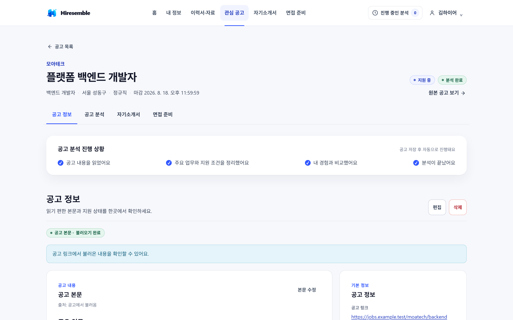

### 공고 분석

공고의 필수 조건·핵심 업무·우대 사항을 항목으로 나눈 뒤, 내가 확인한 경험과 하나씩 맞춰 적합도 점수와 지원 가능성을 계산합니다. 점수는 정해진 배점 규칙으로 계산되고, 계산 방식도 화면에서 펼쳐 볼 수 있습니다.

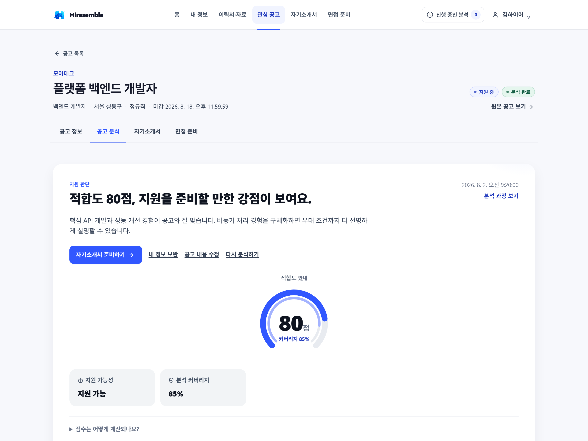

항목별 매칭 현황, 공고 핵심 요약, 내 강점과 보완 포인트가 이어집니다. 각 항목에는 어떤 경험이 근거로 쓰였는지가 함께 표시되고, 공고 내용이나 내 정보가 바뀌면 결과를 예전 분석으로 표시해 다시 분석하도록 안내합니다.

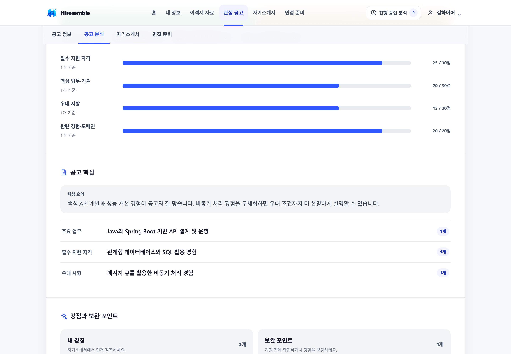

### 자기소개서

공고별로 문항을 만들고 답변을 작성합니다. AI 초안은 선택한 경험만 사용하고, 저장할 때마다 되돌릴 수 있는 버전이 남습니다. 작성한 답변은 검증을 돌려 근거 없이 단정한 표현이 있는지 확인할 수 있습니다.

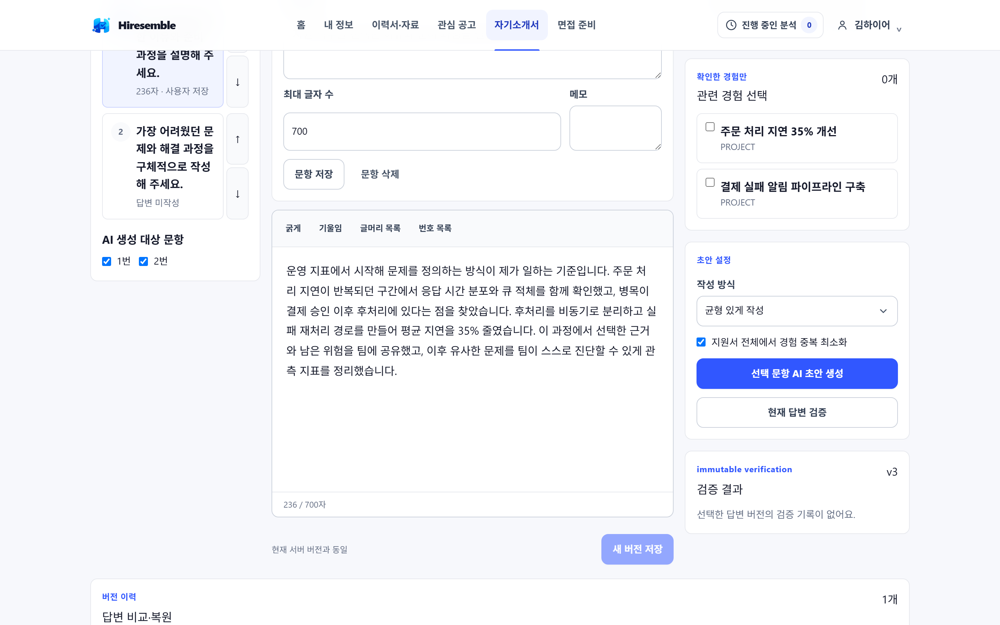

### 면접 준비

회사와 유사 직무의 공개 정보를 조사해 요약하고, 출처와 신뢰 수준을 함께 남깁니다. 커뮤니티 정보와 공식 출처를 구분해 표시하기 때문에 어디까지 믿고 쓸지 판단할 수 있습니다.

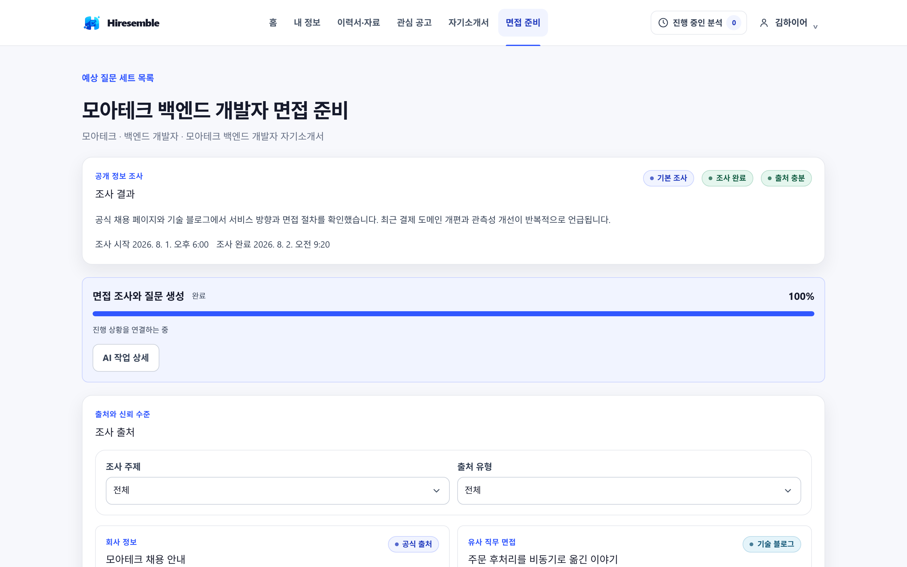

조사 결과와 내 자기소개서를 바탕으로 예상 질문을 만들고, 질문마다 의도·평가 포인트·답변 가이드·꼬리 질문을 제공합니다. 답변을 저장하면 버전별로 피드백을 받을 수 있습니다.

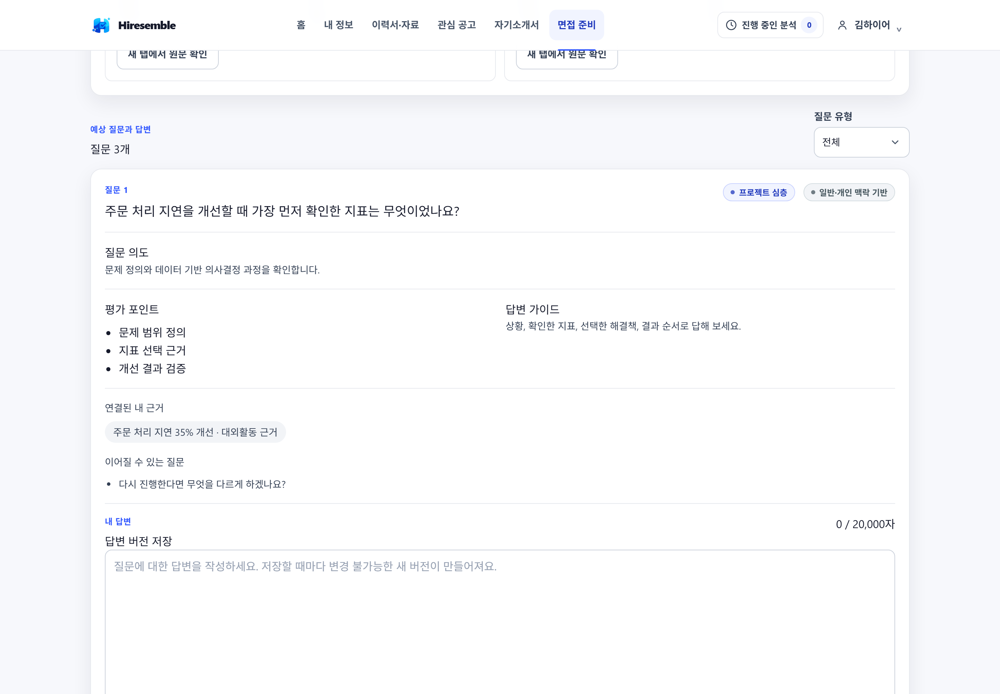

### AI 작업 내역

문서 정리, 공고 불러오기, 공고 분석, 자기소개서 생성처럼 시간이 걸리는 작업은 모두 AI 작업으로 기록됩니다. 진행 상황을 실시간으로 확인하고, 중간에 브라우저를 닫아도 다시 이어서 볼 수 있으며, 실패한 작업은 원인을 확인하고 재시도할 수 있습니다.

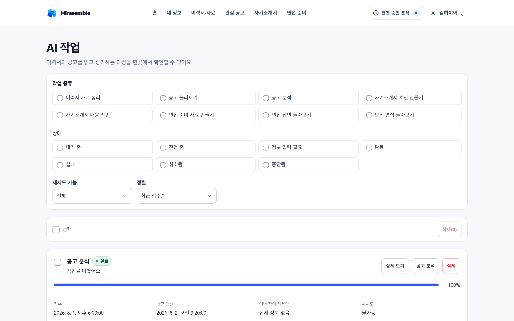

---

## AI를 다루는 방식

Hiresemble은 AI에게 자유롭게 판단을 맡기지 않습니다.

- **통제형 워크플로**: 모델이 스스로 다음 행동을 정하는 자유 루프 대신, 코드로 정의한 단계를 순서대로 실행합니다. 각 단계의 성공·실패와 재시도 가능 여부를 명시적으로 관리합니다.
- **근거 기반**: 분석과 자기소개서는 사용자가 확인한 경험만 근거로 사용합니다. 검색과 조회 범위는 항상 본인 데이터로 제한됩니다.
- **결정론적 점수**: 적합도 점수는 모델이 임의로 매기지 않고 정해진 배점 규칙으로 계산합니다.
- **비용 통제**: 작업마다 비용을 미리 예약하고 실제 사용량으로 정산합니다. 상한을 넘는 요청은 실행되지 않습니다.
- **개인정보 보호**: 프롬프트 원문, 모델 응답 전문, 문서 원문, 임베딩 값은 로그에 남기지 않습니다.

---

## 기술 스택

| 영역      | 사용 기술                                                                  |
| --------- | -------------------------------------------------------------------------- |
| Backend   | Java 21, Spring Boot 4.1, Spring Security, Spring Data JPA, Flyway, Gradle |
| AI        | Spring AI 2.0 (ChatClient, Structured Output, Tool Calling), pgvector RAG  |
| Frontend  | Vue 3, TypeScript 5, Vite, Vue Router, Pinia, TanStack Vue Query, TipTap   |
| Database  | PostgreSQL 18 + pgvector 0.8                                               |
| Storage   | S3 호환 Object Storage (로컬은 MinIO)                                      |
| 문서 처리 | Apache Tika, PDFBox, POI, Jsoup                                            |
| 외부 검색 | Tavily                                                                     |
| 테스트    | JUnit 5, Testcontainers, Vitest, Playwright                                |

```text
hiresemble/
├─ backend/       Spring Boot 모듈 (REST API, 도메인, AI 워크플로)
├─ frontend/      Vue 3 SPA
├─ docs/          기능·API·DB·화면 명세, 설계, 운영 절차, 작업 규칙
├─ .github/       CI와 Dependabot 설정
└─ compose.yaml   PostgreSQL/pgvector, MinIO, 선택적 Mailpit
```

백엔드와 프론트엔드는 로컬 프로세스로 실행하고, 상태가 필요한 개발 인프라만 Docker Compose로 띄웁니다. 공개 HTTP API는 94 operations / 69 paths이며 Spring Session Cookie와 CSRF를 사용합니다. 스키마는 Flyway `V1`~`V22`가 관리합니다.

---

## 로컬에서 실행하기

### 준비물

- Java 21
- Node.js 24 LTS (Corepack 포함)
- Docker Desktop 또는 Docker Engine + Compose

Gradle과 pnpm 버전은 Wrapper와 `packageManager` 필드로 고정되어 있어 따로 설치하지 않아도 됩니다.

### 1. 환경 변수

```bash
cp .env.example .env
```

Windows PowerShell에서는 `Copy-Item .env.example .env`를 사용합니다. `.env`에는 로컬 전용 값만 두며 Git에 포함되지 않습니다. 기본값만 쓸 경우 복사하지 않아도 Compose는 동작합니다.

### 2. 개발 인프라

```bash
docker compose up -d
```

메일 확인까지 필요하면 `--profile mail`을 붙입니다.

| 서비스        | 주소                                       | 용도                     |
| ------------- | ------------------------------------------ | ------------------------ |
| PostgreSQL    | `localhost:${POSTGRES_PORT}` (기본 `5432`) | 애플리케이션 DB          |
| MinIO API     | `http://localhost:9000`                    | S3 호환 API              |
| MinIO Console | `http://localhost:9001`                    | 개발용 Object Storage UI |
| Mailpit SMTP  | `localhost:1025`                           | 개발 메일 수신           |
| Mailpit UI    | `http://localhost:8025`                    | 개발 메일 확인           |

`minio-init` 컨테이너는 `${OBJECT_STORAGE_BUCKET}` 버킷을 비공개로 만든 뒤 정상 종료합니다.

### 3. 백엔드

```bash
cd backend && ./gradlew bootRun
```

Windows에서는 `.\gradlew.bat bootRun`을 사용합니다. 기본 포트는 `8080`, health 경로는 `/actuator/health`입니다.

멱등성이 필요한 mutation을 로컬에서 바로 검증할 수 있도록 `.env.example`은 명시적인 `local` profile과 개발 전용 HMAC 키를 제공합니다. profile을 지정하지 않거나 비로컬 profile에서 `IDEMPOTENCY_HMAC_KEY`가 비어 있으면 애플리케이션은 시작되지 않습니다. 운영에서는 `local` profile을 쓰지 말고 충분한 엔트로피의 versioned secret을 주입해야 합니다.

### 4. 프론트엔드

```bash
cd frontend && corepack pnpm install --frozen-lockfile
```

```bash
cd frontend && corepack pnpm dev
```

기본 주소는 `http://localhost:5173`이고, Vite가 `/api` 요청을 `http://localhost:8080`으로 프록시합니다.

### 5. AI Provider 연결

`local` profile은 OpenAI Chat·Embedding과 Tavily Search를 실제 제품 워크플로에 연결합니다. 키나 설정이 잘못되면 자동으로 Fake로 내려가지 않고 시작 자체가 실패합니다.

```dotenv
SPRING_PROFILES_ACTIVE=local
AI_PROVIDER=openai
AI_PROVIDER_API_KEY=<secret>
AI_EMBEDDING_MODEL=text-embedding-3-small
WEB_SEARCH_PROVIDER=tavily
TAVILY_API_KEY=<secret>
```

네트워크 없이 백엔드만 띄우려면 `SPRING_PROFILES_ACTIVE=local-offline`을 사용합니다. `test`, `ci`, `e2e`와 브라우저 E2E 태스크는 개발 PC에 키가 있어도 네트워크를 강제로 차단합니다. 자세한 절차는 [`docs/operations/ai-provider-activation.md`](docs/operations/ai-provider-activation.md)에 있습니다.

### 인프라 종료

```bash
docker compose --profile mail down
```

개발 데이터까지 지우려면 `docker compose down --volumes`를 의도적으로 실행해야 합니다.

---

## 검증

```bash
cd backend && ./gradlew check
```

```bash
cd frontend && corepack pnpm check
```

프론트엔드 `check`는 lint, 포맷 검사, 타입 체크, Vitest, 프로덕션 빌드를 한 번에 실행합니다.

실제 브라우저 여정은 격리된 PostgreSQL·Spring·Vue·Fake AI·Chromium을 함께 띄우는 전용 Gradle 태스크로 검증합니다. `p4`부터 `p8`까지가 각각 문서, 공고, 공고 분석, 자기소개서, 면접 준비 여정을 담당합니다.

```bash
cd backend && ./gradlew p8BrowserE2eTest
```

Playwright 브라우저는 처음 한 번 설치가 필요합니다.

```bash
cd frontend && corepack pnpm exec playwright install --with-deps chromium
```

---

## 현재 상태와 다음 계획

문서·공고·분석·자기소개서·면접 준비까지의 제품 수직 흐름(P1~P8)은 구현과 브라우저 E2E 검증을 마쳤습니다. 실제 OpenAI·Tavily 연결(P8.5)은 구현을 마쳤고 문서 처리 흐름까지는 실제 호출로 확인했지만, 나머지 수직 흐름의 사용자 로컬 검증이 남아 있습니다.

아직 들어 있지 않은 범위는 다음과 같습니다.

- 대화형 모의 면접과 모의 면접 피드백 (P9)
- 제품 기능 한도, 사용량·원가 집계, 공통 AI 실패 UX (P8.6~P8.8)
- 읽기 전용 관리자 Backoffice (P8.9-A)
- 계정·AI·개인정보 설정 화면 (P10-A)
- 운영 배포 구성

단계별 상태와 검증 이력은 [`progress.md`](progress.md)와 각 모듈의 `progress.md`에서 확인할 수 있습니다.

---

## 더 읽을 문서

- [기능 명세](docs/spec/functional.md) · [API 명세](docs/spec/api.md) · [DB 명세](docs/spec/db.md) · [화면 명세](docs/spec/page.md) · [기술 스택 명세](docs/spec/tech_stack.md)
- [전체 시스템 설계](docs/design/system-architecture.md) · [단계별 구현 계획](docs/design/implementation-plan.md)
- [AI Provider 활성화 절차](docs/operations/ai-provider-activation.md)
- [저장소 작업 지침](AGENTS.md)
